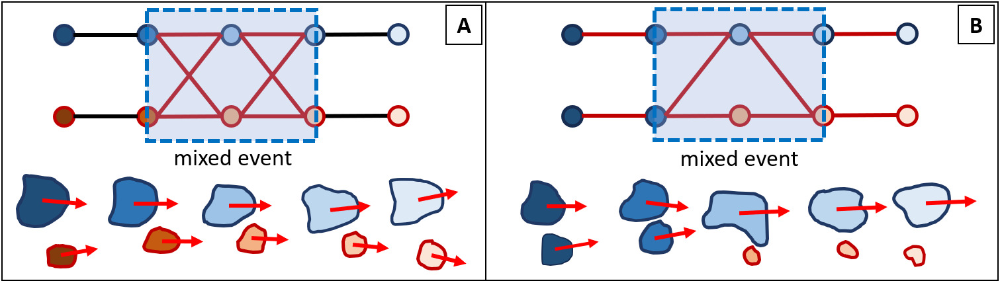

# bubble_process_py

Algorithm is designed to extract contours from a series of images depicting bubbles flow. Original case works with images that are of high contrast, for example as an image image below.

fish-eye correction is applied to images using predefined (mapx.npy,mapy.npy) parameter array (openCV image calibration):

images are cropped by either reading manually edited crop mask (it is an image with red filled rectangle overlay, which specifies remaining image rectangle)
or, if mask is missing, allows you to select crop window via GUI.

mean sequence image is calculated and its subtracted from each image. result is the following:

alternative implementation of mean calculation is using more local (time-narrower) sample sequence

images are binarized and small elements are removed

Some bubbles are fractured into smaller objects but stay as a cluster. This problem is very specficic to out case.
We merge elements of clusters that are within specific threshold distance using dilate-erode morphology operation. This distance is not unversal, so some clusters remain.
This distance cannot be too large, since it will force false merge event when bubbles pass each other close by.
Remaining objects are converted to contours, which allows to filter them out by area (remove small) and from FoV periphiry (border components are removed and also bubbles that fully fit inside thick border zone are removed).

Clustering on single frame:
Since some objects remain in clusters we have to take notice of it and do more refined analysis later. Rough clustering is performed using intersection of contour bounding boxes, which is a simple and fast approach. This method is not very good since its not isotropic and small cluster elements tend to be dropped, thats why we boost their size to size of 100x100 pix for this stage.
We check overlaps between all pairs of bounding boxes on a frame. Those pairs of indicies that overlap are added as edges on a graph and clusters are extracted via connected components method.
Clusters on a graph are represented as nodes in format (time_step, ID1, ID2,..) which allows to store all most useful info in a name. 
Overlap of bounding boxes can be replaced by any other proximity criterion. It just works© for us.

Analyzing time evolution/connectivity of contours.
We calculate bounding boxes of clusters. Bounding boxes are used to determine which bubbles on one frame are related to which bubbles on next frame.
Its done, again, by bounding box overla, since bubbles move only a fraction of their size between frames. We take a pair of frames (1,2) and check if object on frame 1 overlap with all objects on frame 2.
This gives us connections of clusters on this frame pair. This can be repeated on all frame pairs and connections added to a graph as edges.
Using connected components on this 'relation' graph allows to extract temporal chains of nodes, which show which contours bubble consist of on each frame (time step).

If bubbles were rising  one by one without mergees, we would see only long node chains, and each chain can be extracted and analyzed independently of others.
Even if bubbles interact, for example merge, which is represented by two chains merging into one, we can still extract that 'chain' family and do a seperate analysis.

And thats what we do. Connected components provide these families of chains. Using more detailed analysis we can redo clustering without expanding small objects, or by any other means.

In practice we see that most of the time single raising bubble is represented by a single contour (for ring-like objects i take only external contour).
Our main assumption is that nodes on graph that represent single contour bubble and stay that way for some period of time are most likely single bubble raising without interaction with other bubbles.
In fact, most of our analysis is based on this assumption. 

Solo bubble paths:

Thats why first step is to extract node segments that are long chains of nodes. If at some point bubble breaks up into multiple objects either as optical illusion on as a real split, long chain will be terminated and tree of connections will form. Cases where this breakup and merge happen after and before a long single node chain is an optical artifact and our goal is to cover these events and stich chains together. Just for ref these events i call one-to-one (121) or zero path (ZP) events, depending on number of time steps that event spans.

Merges/splits/mixed events:

These events are merges and splits between solo bubble trajectories, so can be retrieved by analyzing connectivity betwenn chains. Its usful to make another graph which represents how chains=segmetns=branches interact. Typical merge is when multiple branches merge into single branch. Splits are the same, but in reverse. 

Cases where multiple incoming branches lead to multiple outgoing branches are classified as mixed events. These can be unresolved events with splits and merges. Or a false event, where two bubbles moved so close that rectangle overlap detected them as a merge.

Overlap criterion is indeed an overestimation, so we have to refine these events by other means. Method we use is to extrapolate bubbles trajetories and other parameters from period where we were certain about them. Trajectory is fairly smooth and so are the changes in area. Using these criteria we can drop faulty edges on graph and resolve bubble trajectories closer to merge/split event.

Other tasks:

Some times graph is to complex to be resolved on first pass, so multiple passes can be done. 

REMARKS ABOUT THE STATE OF CODE AND CODE ITSELF:

Code is designed to perform tracking of objects that at some point undergo segmentation due to degraded image quality.
It does analysis only on two time-adjecent frames, so if on one frame objects is dropped will will pop out as a new object.
Detailed split/merge analysis is not performed. At this point code does its best to resolve events roughly, and returns information such as: these are times at which branches began event X and when event ended these are branches that came out at these times.
Some parts of code like working simultaneously with multiple criterion are rough and need proper rethinking/reworking. Extrapolation is meh.

WORKFLOW IS AS FOLLOWS (UNFINISHED and unedited as 02.12.2023):
i havent used this code on other projects and havent ported this project to other devices for few months. some required libs in python_libraries_install_list.txt are missing, but nothing major.

0) do a backflip
1) launch VS project. might want to create empty and copy on top, instead of cloning. something did not go

2) case setup (input):
	
	set inputImageFolder to fodler with images. images have to named as string with order interger.
	set intervalStart to an intger. this will be the first image in a sequence. int will be extracted from file name.
	set exportArchive = 1 to output exports such as mean image cropped images and binarize images,...
	set useIntermediateData = 1 if you plan to restart and want to skip cropping and binarization stages
	set useMeanWindow = 1 and N, to use moving average like mean image subtraction, where N is mean window width
	set rotateImageBy to -1= no rotation, cv2.ROTATE_90_CLOCKWISE, cv2.ROTATE_90_COUNTERCLOCKWISE, cv2.ROTATE_180 

3) case setup (output):
	set mainOutputFolder to your project name. 
	set mainOutputSubFolders  = [case, subcase, f"{intervalStart:05}-{intervalStop:05}"]
		this will create folder system. i.e case = 'magnetic system 01'; subcase = 'distance = 1 cm'
	['images', 'stages',  'archives', 'graphs'] will be created in deepest folder for output
	imageFolder_pre_run is for folder name for pre-analyis output, for debugging
	imageFolder_output is .. post analysis
4) 
	topFilter, bottomFilter, leftFilter, rightFilter, minArea remove contours new FoV according to these dinstances in pix.

	minChildrenArea = drop contours of area less than this

	fb_radiuss set distance which represents min total displacement of a segment. these are for frozen in place bubbles. drop them

	lr_maxDT maximal time steps left and right of segments at which to search connections to other segments. this slows down alot
		since not optimized well for hard cases. kind of want to keep large. but needs optimization...
	
	t_weights are weights for different criteria : t_sols_c, t_sols_c_i, t_sols_a, t_sols_m ( centroids1,2, area, moment if inertia), last same as area
	
	k_s_ stuff for inderpolation... idk. it very specific. did not test on anything else

	may be something else

on run you will be asked to create a crop mask

